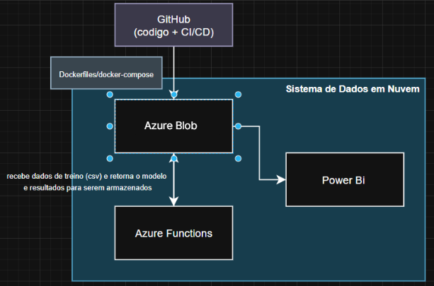

# Sistema de Predição em Nuvem
### Previsão com Azure e Power BI

## Equipe
* **Gabriel Duarte Favero** – 23028103 – gabriel.df3@puccampinas.edu.br
* **Pedro Ernesto Pedreira Bitencourt** – 23016197 – pedro.epb@puccampinas.edu.br
* **Rodrigo Delphino Cavicchioli** – 23012373 – rodrigo.dc1@puccampinas.edu.br

## Descrição Geral
Este projeto consiste em uma solução completa de nuvem para **Predição**. O objetivo é prever a coluna "time" do dataset, de acordo com os 5 lags anteriores.

O sistema recebe dados brutos (CSV), processa-os automaticamente utilizando computação *serverless* (Azure Functions) para aplicar um modelo de **Regressão Linear**, e armazena os resultados processados para visualização no power bi.

## Dataset
O projeto utiliza dados do dataset disponibilizado na matéria de Aprendizado Supervisionado do professor Fernando
* **Arquivo utilizado:** (https://github.com/gabrielDfavero/cloud-system/blob/5cfea8f9de7577f9cdb98d2e753357bebc267fbc/data/PI_test%20(1).csv
* **Volume de dados:** 266 linhas, 9 KB 
* **Colunas principais:** "time": valor real
  * "time-1-5": lags anteriores

## Arquitetura da Solução
Abaixo está o diagrama da arquitetura da solução, detalhando o fluxo de dados entre o GitHub, o ambiente Docker e os serviços de nuvem da Azure até a visualização.

## Referências
* [Documentação Azure Functions](https://learn.microsoft.com/pt-br/azure/azure-functions/)
* [Scikit-learn: Linear Regression](https://scikit-learn.org/stable/modules/generated/sklearn.linear_model.LinearRegression.html)
